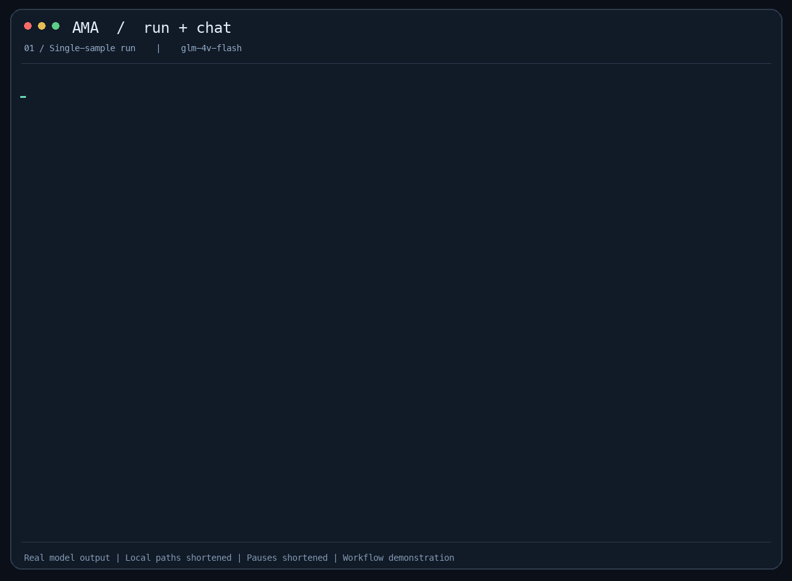

# AMA — one small Agent, two dataset workflows

[中文](README.zh-CN.md) | English

[](https://github.com/Algnite-Solutions/aignite-medical-harness/actions/workflows/ci.yml)

The Agent owns conversation history and optional tools. It knows nothing about datasets or scoring.
The experiment layer feeds observations to it: automatically with `run`, interactively with `chat`.



[Video (MP4)](assets/ama-demo.mp4) · [Terminal recording (.cast)](assets/ama-demo.cast)

Recorded with `glm-vision` on the public ROCOv2 demo: one sample run, its saved result, and two Chinese follow-ups.
The model's original output is preserved, including an omitted caption and incorrect medical inferences;
this demonstrates the workflow, not diagnostic accuracy. Local paths and waiting times are shortened in the GIF/video.
Replay the terminal recording with `asciinema play assets/ama-demo.cast`.

## Get started

```bash
python3 -m pip install -e ".[dev]"
python3 -m pytest -q
# Put your API key in local .env (see .env.example).
ama run datasets/rocov2_demo --model qwen36
ama eval runs/<run-directory>
ama chat datasets/rocov2_demo --episode ROCOv2_2023_test_000001 --model qwen36
```

GitHub Actions runs the deterministic tests and an installed-CLI check on Python 3.11 for PRs to `main`
and updates to `main`. CI requires no model API keys.

Models are aliases in `ama.json`; fake models exist only in tests. A configured alias is not a guarantee
that a provider supports images, tools, or their combination. Requests use standard Chat Completions;
unsupported history is reported, never merged or rewritten.

In the small compatibility check, GLM vision returned a valid Decision
envelope but omitted the caption; the configured Qwen endpoint returned invalid Decisions in the sampled image runs and
rejected a tool-returned-image request. Its text-only tool/follow-up check passed.

`run` starts a new Agent for each episode and requests a JSON Decision per turn.
`chat` sends the first observation immediately. Ordinary text is a follow-up, `/next` releases one
more observation, and `/quit` saves and exits. After the last observation, follow-ups still work.
Chat answers may be natural language; **chat records cannot be scored**.

Both commands automatically check visible data and read the dataset's `instructions.txt`.
Use `--instruction-file path` to replace it. `--max-calls 8` limits API calls per input;
`--timeout 60` sets the per-request timeout. There are no automatic retries or context trimming.

## Optional tools

```bash
ama chat datasets/rocov2_demo --episode ROCOv2_2023_test_000001 --model qwen36 --tools examples/tools.py
```

The Python file explicitly exports `TOOLS: list[Tool]`; both run and chat accept it.
No flag means no tools. Tools are trusted Python, **not sandboxed**: do not expose references or
future observations through them. See [the executable example](examples/tools.py).

Tools return text, JSON or `ToolResult(text="scan", images=["scan.jpg"])`.
Calls execute sequentially with original IDs; all tool results precede image attachments.
Tool errors go back to the model. API errors terminate the episode instead of prompting a repair.

## Read in four steps

1. [model.py](src/ama/model.py): registration, image encoding and one request.
2. [agent.py](src/ama/agent.py): full multi-turn history.
3. [tools.py](src/ama/tools.py) + the Agent loop: optional tool calls.
4. [runner.py](src/ama/runner.py) + [cli.py](src/ama/cli.py): observations, decisions and commands.

The [Chinese code walkthrough](docs/minimal-agent.zh-CN.md) includes runnable review examples.

## Data and results

```bash
ama import rocov2 --source /path/to/ROCOv2 --out datasets/rocov2 --split test --limit 100
```

For a subset, use `ama run datasets/rocov2 --model qwen36 --split test`, or repeat
`--episode ID` instead of `--split`. Use `--runs-root path` to choose the output parent.

ROCOv2 is the only built-in importer/demo. Each image is one episode/turn; ordered multi-turn datasets
also work. See the [format](docs/ama-dataset.md) and [data card](datasets/rocov2_demo/DATASET_CARD.md).

The later-added Symptom2Disease importer and text demo are documented in the
[Symptom2Disease demo data card](datasets/symptom2disease_demo/DATASET_CARD.md),
including import, validation, and run instructions.

Records include `manifest.json` (actual prompts, hashes, configuration and expected turns),
`events.jsonl` (message roles/sources, raw replies, tool results, calls), and for run only
`decisions.jsonl`. Images stay as paths in logs and are encoded only for requests.
Invalid decisions are kept, without correction dialogues. Failed/missing turns remain in evaluation.
API/call-limit failures skip the rest of that episode and continue the batch; Ctrl-C stops the batch.
Partial runs return a nonzero CLI status and remain independently evaluable.

Only `eval` opens references/rules, producing `metrics.json`.
It checks visible input hashes before scoring. Original answers remain in `decisions.jsonl`;
references stay in the dataset's `targets.jsonl`. Caption-word and concept-ID overlap are not clinical accuracy. Historical runs are preserved but must
be rerun for this evaluator. Provenance never enters model input.
