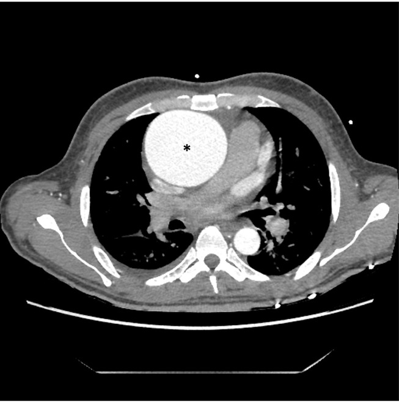
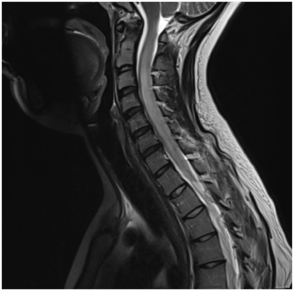
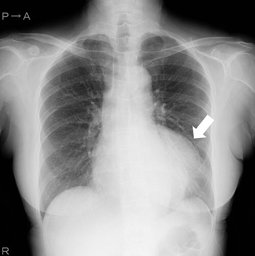

# ROCOv2：实验室中文阅读指南

先把这项实验理解成“看图写一句话”。模型还需要输出一组医学概念编号，程序分别比较文字和编号与参考答案的重合程度。

## 先认清三个东西

| 项目 | 含义 | 例子 |
|---|---|---|
| image / Evidence | 模型看到的图像 | 一张胸部 CT 图 |
| caption | 描述图像的一句英文 | A chest CT image.（一张胸部 CT 图像。） |
| CUI / cuis | UMLS 医学概念的唯一编号 / 编号列表 | C0040405 |

CUI 是编号，不能只凭它推断疾病或严重程度。完整 ROCOv2 数据中的 `cui_mapping.csv` 提供英文概念名称；查名称后再解释术语。当前三个示例的参考编号保存在 `targets.jsonl`，模型运行时不会读它。

## 三个示例的原文和中文对照

下面翻译的是数据集给出的参考 caption。中文用于帮助读原文，没有另做图像诊断，也没有补充原文缺失的信息。

### 000001

原文：CT chest axial view showing a huge ascending aortic aneurysm (*).

中文：胸部 CT 轴位图像显示一个巨大的升主动脉瘤（星号所示）。

拆开读：CT chest（胸部 CT）→ axial view（轴位图像）→ showing（显示）→ ascending aortic aneurysm（升主动脉瘤）。

### 000009

原文：Early sagittal T2-weighted MRI.

中文：早期矢状位 T2 加权磁共振图像。

原句很短，没有明确说明病变或“早期”的具体时间。读结果时保留这种信息缺失。

### 000015

原文：Chest radiography shows aneurysm as protruding mass.

中文：胸部 X 线片显示动脉瘤呈向外突出的肿块影。

## 这三个例子里的术语

| 英文 | 中文读法 |
|---|---|
| CT | 计算机断层成像 |
| MRI | 磁共振成像 |
| chest | 胸部 |
| axial view | 轴位图像 |
| sagittal | 矢状位 |
| T2-weighted | T2 加权 |
| radiography | X 线摄影；此处指 X 线片 |
| ascending aortic | 升主动脉的 |
| aneurysm | 动脉瘤 |
| protruding mass | 向外突出的肿块影 |

## 如何看分数

运行 `ama eval` 后打开运行目录的 `report.md`，逐例对照图像、模型原文和参考原文。

- 描述词精确率：模型写出的词，有多少能在参考描述中找到。
- 描述词召回率：参考描述里的词，有多少被模型覆盖。
- 描述词 F1：精确率和召回率的综合。代码会统一大小写并按字母/数字切词，不理解同义词或否定含义。
- 概念编号 F1：比较两组 CUI 编号的重合程度。
- 引用覆盖率：检查模型是否引用了要求的图像 ID。

例如模型写 “A chest CT image.”，它可以匹配 CT 和 chest，却没有写出参考描述中的病变。词重合高也可能遗漏否定词；词重合低也可能只是用了同义词。因此这些分数衡量参考答案的一致程度，不能直接叫“诊断准确率”。

遇到新术语，可以先把原句和模型回答并排，逐句做中文翻译，保留缩写、左右侧、否定词和不确定语气。翻译或解释拿不准的部分标出来，再请熟悉影像的人核对。涉及模型是否作出了正确医学判断时，仅靠翻译和词匹配不能定论。

## 如何看代码

打开 `src/ama/agent.py` 的 `run_episode`，沿着四步读：

1. 将本轮 Evidence 加入可见材料。
2. 用 `DirectDecisionProtocol.turn_messages` 组装消息和图像。
3. `model.next` 发出请求，`DirectDecisionProtocol.step` 解析答案。
4. `recorder.save_decision` 保存这一轮，继续下一轮。

评测由另一条 `ama eval` 命令触发，最后才读参考答案。工具使用的扩展接口在 `protocols.py`，当前读主流程时只需看直接决策实现。
